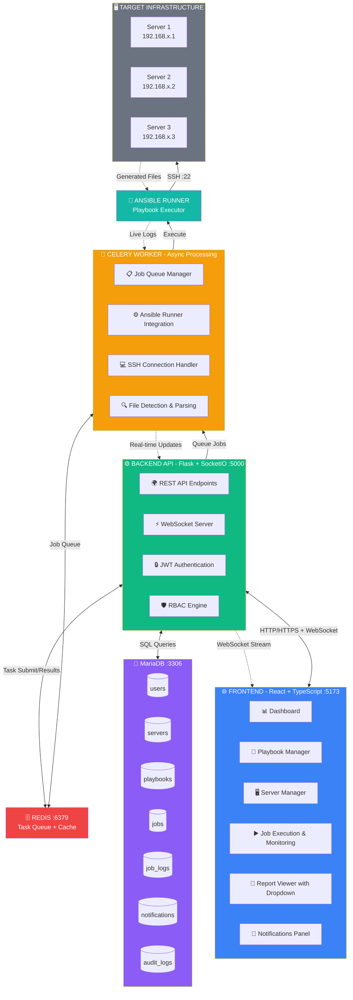
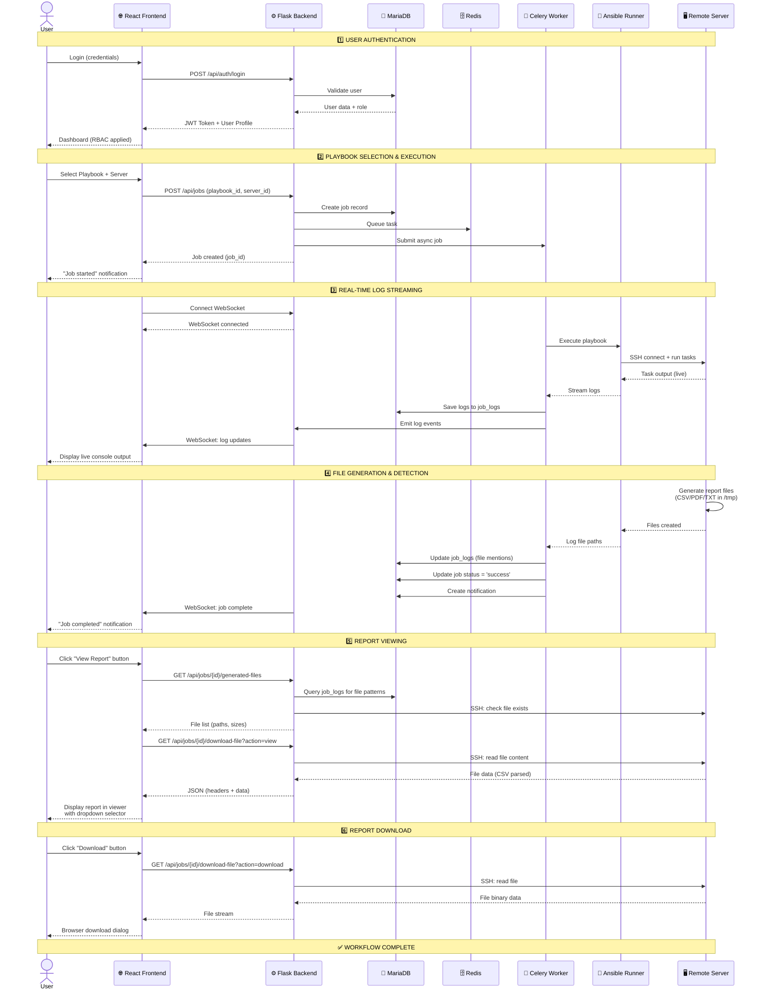

# InfraAnsible Architecture Diagrams

## System Architecture Diagram

This diagram shows all components and their connections in the InfraAnsible platform.



---

## Workflow Sequence Diagram

This diagram shows the complete user journey from login to report download.



---

## Component Details

### Frontend Layer (React 18 + TypeScript)
- **Technology Stack**: Vite, Tailwind CSS, Zustand, React Router, Lucide Icons
- **Port**: 5173
- **Features**:
  - Dashboard with job statistics and metrics
  - Playbook management (upload, edit, delete)
  - Server management (add, configure, test SSH)
  - Job execution and real-time monitoring
  - Report viewer with multi-file dropdown selector
  - Real-time notification panel
  - Role-based UI rendering (RBAC)

### Backend Layer (Flask + Flask-SocketIO)
- **Technology Stack**: Python 3.9+, Flask 2.x, SQLAlchemy, Flask-SocketIO, Paramiko
- **Port**: 5000
- **Features**:
  - RESTful API endpoints
  - WebSocket server for real-time log streaming
  - JWT authentication with secure token management
  - RBAC engine (Admin, Operator, Viewer roles)
  - File detection and parsing
  - SSH connection management

### Task Queue (Celery)
- **Technology Stack**: Celery, Redis as broker
- **Features**:
  - Async job processing
  - Ansible Runner integration
  - SSH connection pooling
  - Generated file detection from logs
  - Real-time log emission

### Message Broker & Cache (Redis)
- **Port**: 6379
- **Usage**:
  - Celery task queue
  - Celery result backend
  - Session caching
  - Temporary data storage

### Database (MariaDB/MySQL)
- **Port**: 3306
- **Tables**:
  - `users` - User accounts and authentication
  - `servers` - Managed server inventory
  - `playbooks` - Ansible playbook metadata
  - `jobs` - Job execution records
  - `job_logs` - Real-time log storage
  - `notifications` - User notifications
  - `audit_logs` - System audit trail

### Automation Engine (Ansible Runner)
- **Features**:
  - Playbook execution
  - Dynamic inventory management
  - Module loading and execution
  - Real-time output capture
  - Error handling and reporting

### Target Infrastructure
- **Connection**: SSH (Port 22)
- **Supported OS**: Linux (CentOS, RHEL, Ubuntu, etc.)
- **Features**:
  - Remote playbook execution
  - File generation (/tmp, /var/tmp)
  - System configuration management
  - Package management
  - Service control

---

## Data Flow Patterns

### 1. Authentication Flow
```
User → Frontend → Backend API → MariaDB → Backend API → Frontend → User
```

### 2. Job Execution Flow
```
User → Frontend → Backend API → Celery Worker → Redis → Ansible Runner → Remote Server
```

### 3. Real-time Monitoring Flow
```
Ansible Runner → Celery Worker → Backend API (WebSocket) → Frontend → User
```

### 4. Report Generation Flow
```
Remote Server (generates files) → Ansible Runner → Celery Worker → Backend API → Frontend (Report Viewer)
```

### 5. Notification Flow
```
Backend API → MariaDB (notifications) → Backend API → Frontend (Notification Panel) → User
```

---

## Key Features

1. **Real-time WebSocket Logging** - Live log streaming during playbook execution
2. **Role-Based Access Control (RBAC)** - Admin, Operator, and Viewer roles
3. **Auto-detect Generated Reports** - Automatically finds and displays CSV/PDF/TXT files
4. **Multi-Server SSH Management** - Secure SSH connections to multiple servers
5. **Async Job Queue Processing** - Non-blocking job execution with Celery
6. **Interactive Playbook Execution** - User input during playbook runs
7. **Audit Trail & History** - Complete audit logging of all actions
8. **Notification System** - Real-time alerts for job status changes
9. **Multi-file Report Viewer** - Dropdown selector for multiple generated files
10. **CSV Table Rendering** - In-browser CSV viewing with download option

---

## Technology Stack Summary

| Layer | Technology | Purpose |
|-------|-----------|---------|
| Frontend | React 18 + TypeScript | User interface |
| Build Tool | Vite | Fast development and bundling |
| Styling | Tailwind CSS | Utility-first CSS framework |
| State Management | Zustand | Lightweight state management |
| Icons | Lucide React | Modern icon library |
| Backend | Flask 2.x | Python web framework |
| Real-time | Flask-SocketIO | WebSocket implementation |
| ORM | SQLAlchemy | Database abstraction |
| SSH | Paramiko | SSH client for Python |
| Task Queue | Celery | Async task processing |
| Message Broker | Redis | Task queue and caching |
| Database | MariaDB/MySQL | Relational database |
| Automation | Ansible Runner | Infrastructure automation |
| Authentication | JWT | Secure token-based auth |

---

## Deployment Architecture

```
[Development]
- Frontend: npm run dev (Vite Dev Server)
- Backend: python run.py (Flask Dev Server)
- Celery: celery worker (Single worker)
- Redis: Local instance
- MariaDB: Local database

[Production]
- Frontend: Nginx + Static files (Built with npm run build)
- Backend: Gunicorn + Flask + Nginx reverse proxy
- Celery: Multiple workers with supervisor/systemd
- Redis: Redis Cluster or Sentinel
- MariaDB: Master-Slave replication
```

---

## Security Features

1. **JWT Authentication** - Secure token-based authentication
2. **Password Hashing** - Bcrypt password hashing
3. **RBAC** - Role-based access control at API level
4. **SSH Key Management** - Secure SSH credential storage
5. **CORS Configuration** - Controlled cross-origin access
6. **Input Validation** - Marshmallow schema validation
7. **SQL Injection Protection** - SQLAlchemy ORM
8. **File Path Restrictions** - Limited file access to /tmp and /var/tmp
9. **Audit Logging** - Complete action tracking
10. **Session Management** - Redis-based session storage
